# webxr-pwa-factory
Progressive Web Apps example

## Task 1. Start App and audit PWA with Chrome Lighthouse utility

- In terminal call
 ```
npx http-server -p 8080
```
- Open http://localhost:8080 in Chrome browser
- Launch Lighthouse utility from Developer tools
Expected audit results
  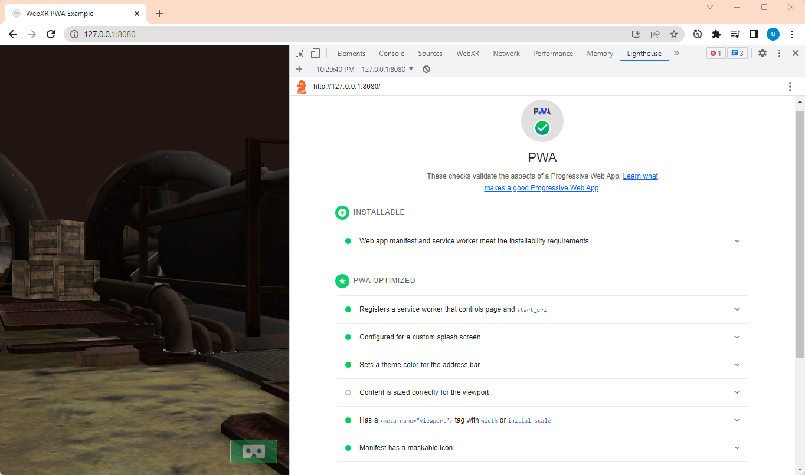

## Task 2. Deploy to your `github.io` web page
1. Create new repository
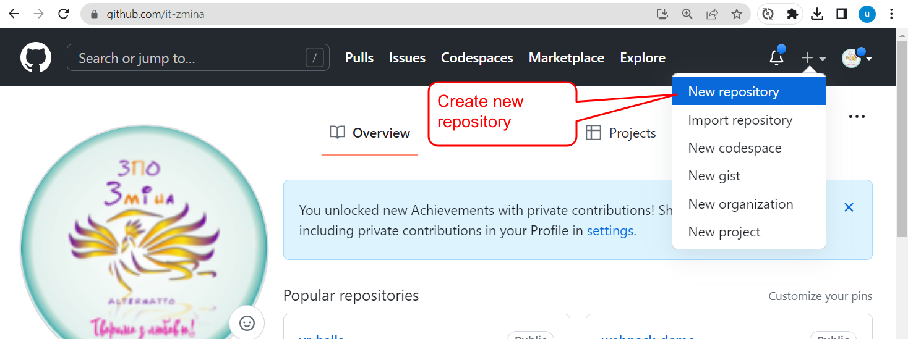
2. Insert repository name and click `Save` button
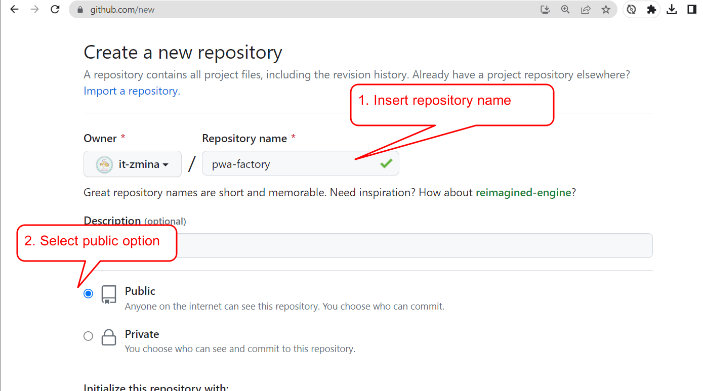
3. Copy link to your repository
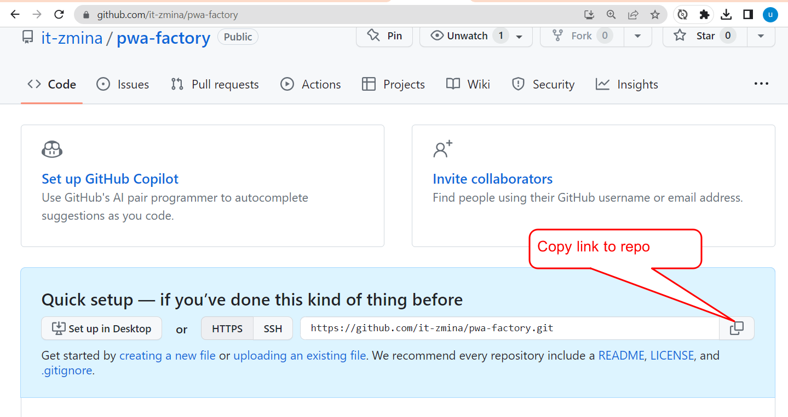

4. Open terminal. Then add access token to the copied repository link and set as your origin repository
```aidl
git remote set-url origin https://<ACCESS_TOKEN>@github.com/it-zmina/pwa-factory.git
```
## Task 3. Generate APK file and install to your VR headset

1. Navigate [https://www.pwabuilder.com/](https://www.pwabuilder.com/) and insert link to your PWA web page
   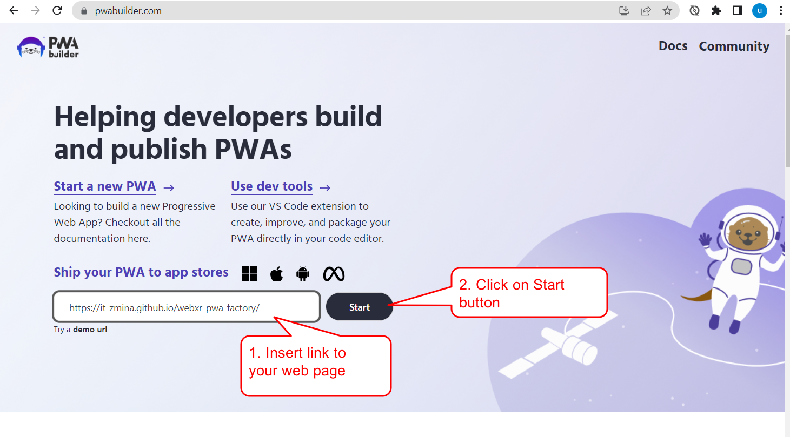

2. Select packaging for stores
   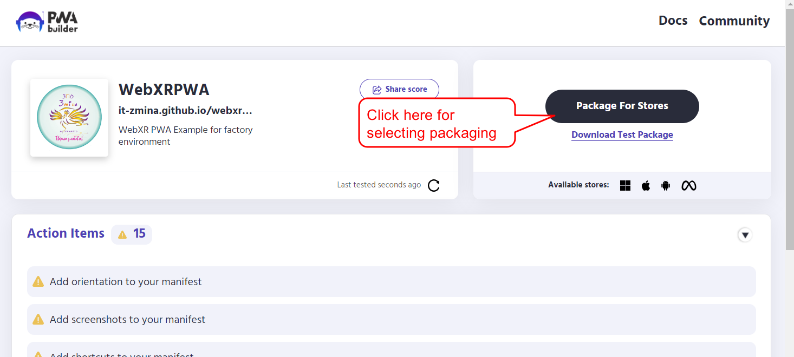

3. Select Meta Quest Store
   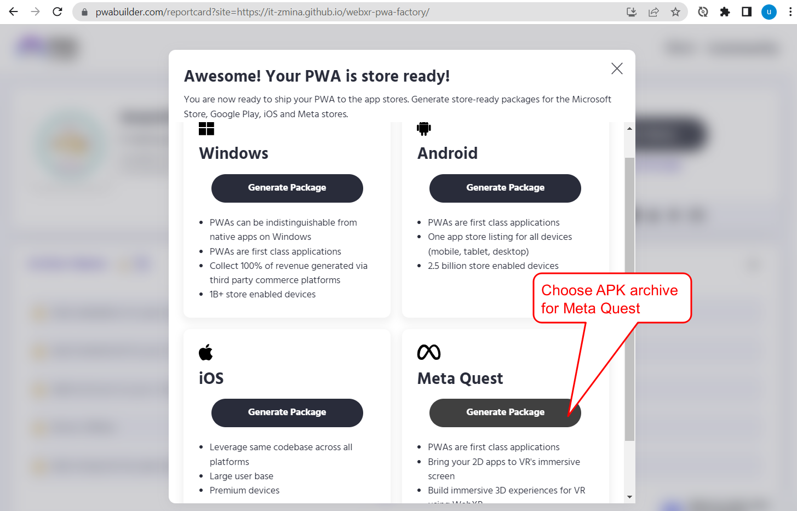

4. Generate and download APK package
   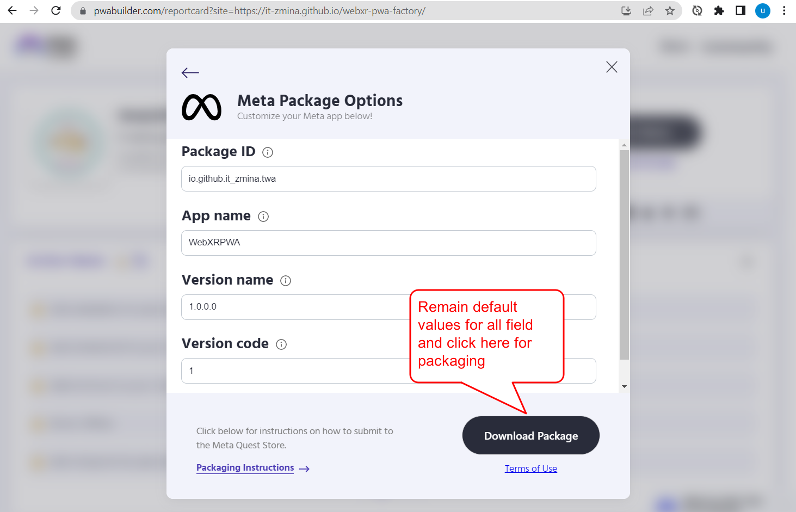
   
## Install APK file to your VR headset

1. Enable debug via USB port
   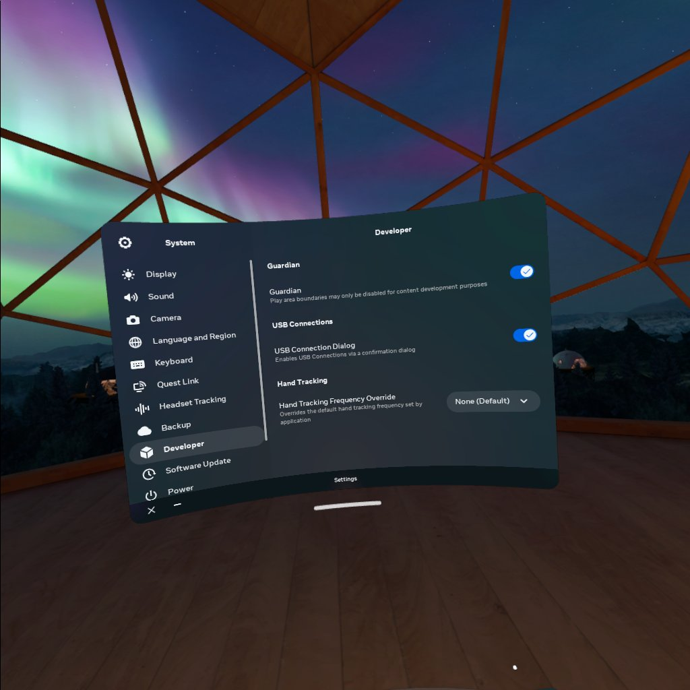
2. Connect VR headset to your PC.
3. Open SideQuest app on your PC and install APK archive.
  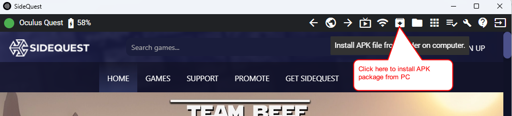

4. Select applications from unknown sources
 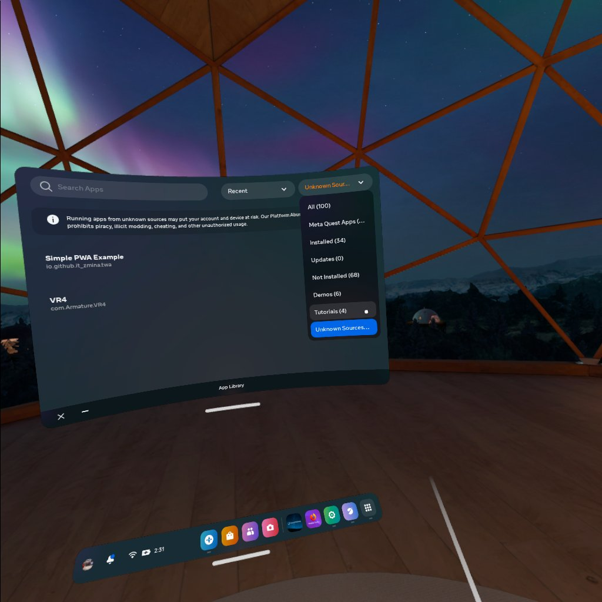

5. Launch installed application
 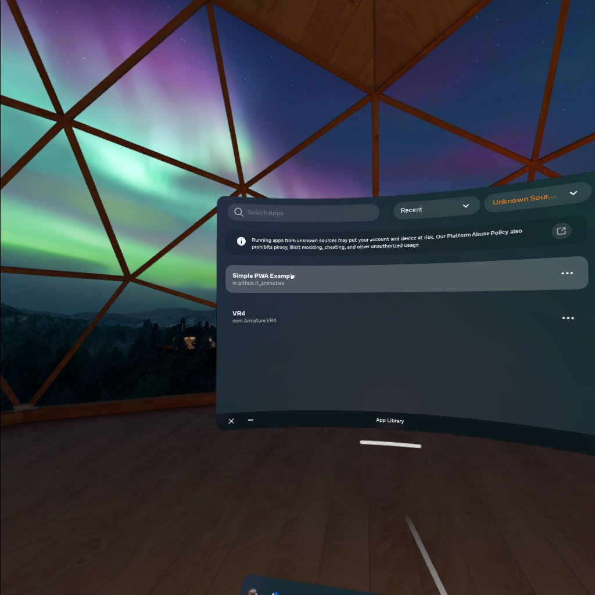
